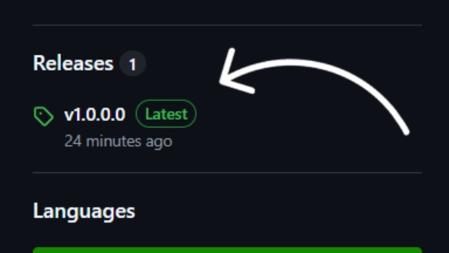
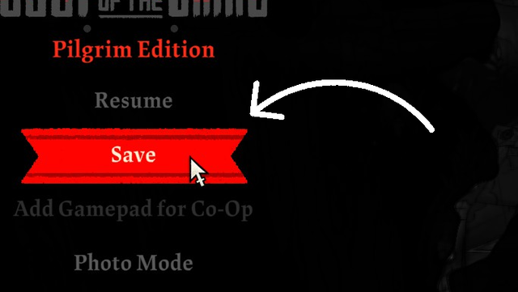
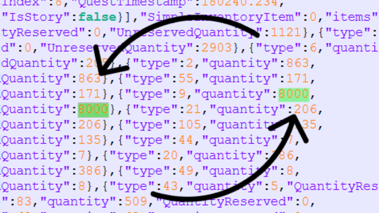
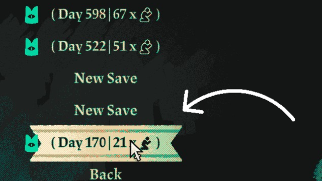
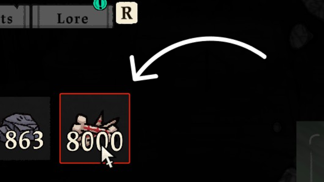

# Cult of the Lamb Save File Extractor and Loader

A BepInEx plugin that enables Cult of the Lamb save file editing via `.json`.

> [!WARNING]
>
> ## DISCLAIMER
>
> This plugin has the potential to corrupt and overwrite your save files! Make sure that you have a recent backup on hand and are aware of the consequences of using this plugin before continuing with the installation.
>
> If you encounter any issues that arise after modifying your save file, please make sure that you also test that it loads your save file properly in the vanilla (un-modded) game and make sure that you do not have other mods running alongside this plugin. Once you have confirmed that, you may [create an issue](https://github.com/osoclos/CotlSaveExtractorLoader/issues) in this repository first to make sure the green light is given by the creator (osoclos) before reporting it as an official bug to Massive Monster.

## Prerequisites

- [BepInEx](https://docs.bepinex.dev/index.html) - A tool to allow modding within Unity games. [[Setup Guide](https://docs.bepinex.dev/articles/user_guide/installation/index.html)]
- [Notepad++](https://notepad-plus-plus.org/) - A program to edit large text files. (Optional, but recommended) [[Download Page](https://notepad-plus-plus.org/downloads/)]

## Installation

1. First, head over to the Releases section on the right of the GitHub repository homepage and click on the latest release displayed.

2. Download the `.dll` file listed below the release details.

3. Open up your Downloads folder and drag the downloaded `.dll` plugin file into your BepInEx plugins folder in the Cult of the Lamb game folder.

---

Alternatively, you may wish to clone this repository using `git clone` and build the `.dll` file yourself by opening the `.sln` file in [Visual Studio](https://visualstudio.microsoft.com/) and running the build commands.

## Usage

After installing the plugin, you can run Cult of the Lamb like how you normally would.

> [!WARNING]
>
> Before you proceed with the steps after this point, please make sure that you backup any save files that you would want to keep safe in case of a corruption/overwrite.

1. Load up any save file of your choice and save the game file upon completing loading of said file.

2. After saving, an extracted version of your save file can be located in your saves folder as a `.json` format (By default, this file will be named `slot_#-extracted.json`). From there, you can modify it using a program (such as Notepad++) and change the values in the `.json` file.

### Example modification (Changing the quantity of a specific item)

There is a lot of data that you can mess around with in the extracted `.json` save file. If you are not sure where to start, we can do a simple modification whereby we change the quantity of a specific item in the inventory.

1. Open up Notepad++ (or any other text editing program) and search `"items"` (include the quotation marks!) in the file (either by pressing <kbd>Ctrl</kbd> + <kbd>F</kbd> or clicking the `Find` feature in your text editor).

2. Find an entry that is in the following format (`"items":[{ ... }]`) and change the values in the `"quantity"` and `"UnreservedQuantity"` entries inside any one of the curly brackets. (In my example, I chose to modify the number of bones [represented by `"type": 9`], but you may also change the quantity of any item in your current inventory)

3. Go to the main menu **WITHOUT SAVING** (saving will overwrite your modifications) and open up your modified save.

4. If you the number of bones you have is the same as what you entered in the extracted `.json` save file, congratulations! You have successfully modified a save file!

5. Go forth and explore further! There is so much to modifying save files (and modding in general) and I hope this little adventure serves as a starting point to give you the headstart you need to move on!

## Docs

Some of the save file data, such as item IDs, are not alphabetical identifiers and as such, can be difficult to decipher without any references.

While most of them can be deciphered by decompiling the game, I want to make it easy for the average player to do so. Therefore, a compiled list is necessary if I want to meet that goal.

Fortunately, people have made such [a list](https://docs.google.com/spreadsheets/d/13o-pZMtQHzecb0qvWwSIXex53NpUZNZphtvm4agTNJg/edit?usp=drivesdk) and to give credit where credit is due, I would like to thank `@friendofsilkies` over on Discord for providing it!

## Configuration Options

This contains the description of configuration entries for this plugin. (`mod.osoclos.cotl.save-extractor-loader.cfg`)

### `ExtractSaveFiles` (default: `true`)

Enable extraction of save files.

### `ExtractedJsonSuffix` (default: `"extracted"`)

The string that will be appended after the filename to prevent overwriting of the default `slot_#.json` file. Leaving it empty will overwrite it.

### `ForceLoadJsonFiles` (default: `true`)

Whether to read the extracted `.json` save files instead of the `.mp` save files, if available.
